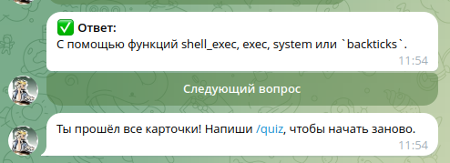

# Self Training Bot

**Self Training Bot** — это Telegram-бот на базе `aiogram`, который помогает подготовиться к собеседованиям по темам и вопросам в формате карточек с вопросами и ответами. Пользователь получает случайные вопросы, может посмотреть ответ и перейти к следующему.

---

## Возможности

- Выдача случайных вопросов из набора карточек
- Поддержка категории вопросов
- Пошаговое взаимодействие с кнопками
- Логирование ответов пользователя
- Поддержка Markdown-форматирования
- Персональная история вопросов для каждого пользователя

---

## Быстрый старт

### 1. Установите зависимости

```bash
pip install -r requirements.txt
```

## 2. Создайте .env файл
Создайте .env в корне проекта со следующим содержимым:

```
API_TOKEN=ваш_telegram_api_token
CARDS_FILE=php_cards.json
LOG_FILE=user_answers.log
COURSE_NAME=PHP
```

Пример .env приведен в .env.dist

## 3. Добавьте файл карточек
Создайте php_cards.json со структурой:

```{
  "ООП": [
    ["Что такое инкапсуляция?", "Инкапсуляция — это механизм..."],
    ["Что такое наследование?", "Наследование — это механизм..."]
  ],
  "Стандартные функции": [
    ["Что делает функция `array_map`?", "`array_map` применяет функцию ко всем элементам массива..."]
  ]
}
```

## 4. Запустите бота
python main.py

## Команды
/start — Приветствие

/quiz — Начать сессию вопросов

## Структура проекта

```
└── data
    └── cards.json           # Карточки с вопросами для самопроверки
└── logs
    └── user_answers.log     # Логирование ответов
├── .env                     # Секреты и настройки
├── main.py                   # Основной код бота
├── requirements.txt         # Зависимости
└── README.md

```

## Принцип работы бота

- При команде /quiz пользователь получает случайный вопрос из набора.
- Ответ отображается при нажатии кнопки "Показать ответ".
- После просмотра ответа — кнопка "Следующий вопрос".
- История вопросов сохраняется в user_history, чтобы избежать повторов.
- Ответы логируются в user_answers.log в формате JSON.

Так это выглядит в Telegram Desktop


Когда все карточки просмотрены


Во время прохождения карточек ведется журнал:
```
{"user_id": 338167232, "username": "akozadaev", "timestamp": "2025-06-18T11:54:27.074919", "question": "Разница между стрелочной и анонимной функцией?", "answer": "Стрелочные лексически захватывают переменные. Анонимные могут изменять по ссылке."}
{"user_id": 338167232, "username": "akozadaev", "timestamp": "2025-06-18T11:54:31.924180", "question": "Как выполнить shell-команду в PHP?", "answer": "С помощью функций shell_exec, exec, system или `backticks`."}

```

## Зависимости

- aiogram 3.x
- зthon-dotenv

## Лицензия

MIT License. Используйте, модифицируйте, улучшайте.

## Дополнительно
Код этого проекта запуcrftncz на https://replit.com/ и вы можете проверить (в случае, если код запущен) его работоспособность https://t.me/akozadaev_training_bot.